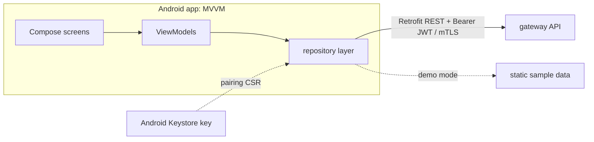

# homelab-app


A native Android ops cockpit for a self-hosted homelab. It pairs with a private
gateway over a VPN, then lets you watch host metrics, start/stop/restart
services, read container logs and triage an inbox from the phone.

A device-bound key is generated in the Android Keystore during pairing and never
leaves the device. Running requests authenticate with a bearer JWT; the client
also presents its certificate for mutual TLS once the gateway is reached over
HTTPS. There is a public, offline **demo mode** on the pairing screen, so the app
can be explored without a gateway.



## Features
- **Pairing**: scan a QR code, generate a device-bound EC key in the Android
  Keystore, sign a PKCS#10 CSR, exchange it for a bearer token and client
  certificate. The gateway URL and CA fingerprint from the QR are both used
  (dynamic base URL, certificate pinning).
- **Overview**: host metrics (CPU, RAM, disk, temperature, load) plus an up/down
  rollup derived from the service list
- **Services**: list, detail, start/stop/restart (uniformly confirmed), logs
- **Inbox**: list, note, triage
- **Settings**: connection test, in-app update, local action confirmation, unpair
- **Demo mode**: fully offline, static sample data, no gateway required

## Security
Security-critical controls (authentication, authorization, rate limiting) are
enforced **server-side**. The client adds defense-in-depth layers:

- **Device-bound key**: non-exportable EC-P256 key in the Android Keystore
  (hardware-backed when available); only a CSR leaves the device
- **mTLS**: the client certificate is presented via a custom
  `X509ExtendedKeyManager` signing with the Keystore key, and a TrustManager
  pins the homelab CA (no trust-all). Active once the gateway answers over TLS.
- **Encrypted at rest**: the JWT and certificates are encrypted with an
  Android Keystore AES-GCM key before hitting DataStore; excluded from backup
- **CA pinning**: the QR CA fingerprint is verified against the gateway CA at
  pairing (fail-closed)
- **Transport**: release builds forbid cleartext (TLS required); the internal
  debug build allows HTTP over the VPN
- **Update safety**: the in-app updater only resolves a same-origin APK URL;
  integrity is enforced by Android's APK signature check

See [`docs/SECURITY.md`](docs/SECURITY.md), [`docs/ARCHITECTURE.md`](docs/ARCHITECTURE.md)
and [`docs/API_CONTRACT.md`](docs/API_CONTRACT.md).

## Architecture
- **MVVM** with a `ViewModel` per screen over a repository layer
- **Retrofit** service interfaces per backend area, DTOs mapped to UI state
- **Hilt** for dependency injection; a non-blocking in-memory session state keeps
  the OkHttp auth interceptor off the DataStore hot path
- **Jetpack Navigation** for the screen graph

## Tests
JVM unit and integration tests cover the certificate fingerprint logic, the
update-URL origin validation, error mapping, QR parsing and the repository demo
branch. CI runs the tests plus Android lint and builds the debug APK.

```bash
./gradlew testDebugUnitTest
./gradlew lintDebug
./gradlew assembleDebug   # -> app/build/outputs/apk/debug/
```

The gateway base URL is never hardcoded in source. It comes from the scanned QR
code at runtime; the checked-in build default is a neutral loopback placeholder
(overridable via `-Pcockpit.gatewayUrl=...` or `COCKPIT_GATEWAY_URL`).

## Stack
- **Kotlin**, **Jetpack Compose**, **Retrofit/OkHttp**, **Hilt**, Coroutines,
  Kotlin Serialization, DataStore, Android Keystore, Bouncy Castle (CSR),
  CameraX + ML Kit (QR), AndroidX Biometric
- Gradle (Kotlin DSL, version catalog), min SDK 28, target/compile SDK 35

MIT licensed.

## About this snapshot

The gateway this app pairs with is private, so its address, the CA and the finer
details of the API surface are not in here. A script takes them out, rewrites
internal addresses and paths to placeholders, and refuses to push while either of
two secret scanners is unhappy.

One commit rather than the real history. The app lives on my own phone, paired
with my own gateway. Demo mode on the pairing screen needs none of that, if you
just want to see what it looks like.
